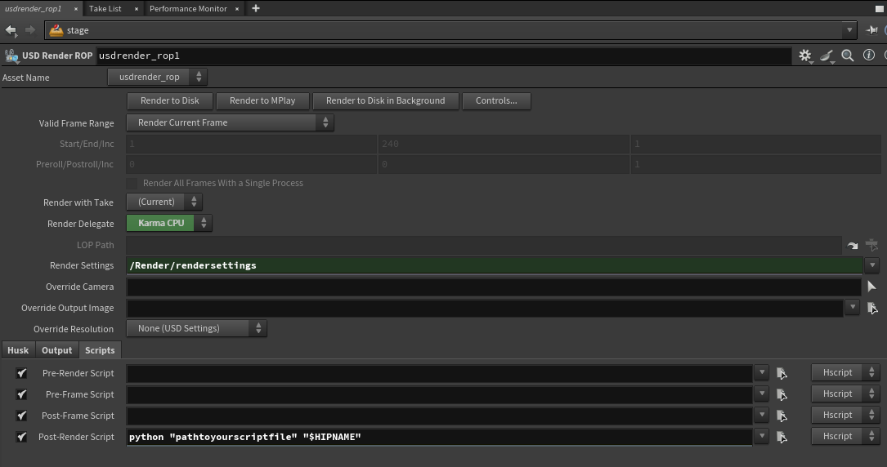

# CGscripts
A repository of scripts for various VFX and 3D programs


# Discord Notification Script

## Description

Sometimes it's nice to be able to setup a long render and you can go do something else without having to check if your render is completed. If you have Discord on your phone, like I do, this will enable you to receive push notifications when your applications are done rendering.

## 1. Initial Setup
### Install Python 

[Download and install Python](https://www.python.org/downloads/) making sure it's accessible in the system PATH
	tip: when installing Python you can check _Add Python 3.xx to PATH_

Once Python is installed, install the _requests_ library in a terminal window:
```
	pip install requests

```

## 2. Setting Up Discord

[Create a Discord server](https://discord.com/) if you haven't already

Navigate to _Server Settings_ and look for _Integrations_


Create a new Webhook and give it a name and an icon if you wish

Optional: Set up Webhooks per application to allow for a unique icon per notification
	Note: This requires duplicates of the script that each program will run, the only change being unique Webhooks per program


Press _Copy Webhook URL_ and it will add it to your clipboard

Replace _"webhookurl"_ with the URL of your Discord Webhook


That's it! Your script should now send a Discord message to the channel once we set up the scripts in our applications

## 3. Setting Up the Script

Currently, the script is tested to work with Houdini, Fusion, and Blender, but it theoretically should work with any program that can run Python.

### 1. Houdini

- In your Houdini render ROP, find the _Scripts_ tab and locate the _Post-Render Script_ box. Ensure the script type is set to _Hscript_

- Houdini will pass the name of the Houdini file to the Discord notification using the "$HIPNAME" tag

```
python "pathtoyourscriptfile" "$HIPNAME"
```



### 2. Fusion

- In your Fusion composition, add this node:

```
{
	Tools = ordered() {
		RunCommand1 = RunCommand {
			CtrlWZoom = false,
			Inputs = {
				HideFrame = Input { Value = 1, },
				Wait = Input { Value = 1, },
				EndCommand = Input { Value = "pathtoyour.py yourcompname", },
				StartRenderScripts = Input { Value = 1, },
				EndRenderScripts = Input { Value = 1, }
			},
			ViewInfo = OperatorInfo { Pos = { 355.956, 285.245 } },
		}
	}
}
```


- Navigate to the _End Command_ tab

- Replace "pathtoyourscriptfile" with the ".py" file on your system

- Currently, using this script in Fusion requires manually entering the name of the file
	Replace "yourcompname" with the name of your comp


### 3. Blender

#### Install the _Render Complete Script Executor_

- Install the _run_script_on_finish_addon.py_ add-on in Blender. In versions of Blender 4.2 and higher, navigate to the top right and choose _Install from Disk_


- Select where your script is located in the _Script Path_ box

- Test the script using either the _Test Script_ button or by rendering a scene

- Blender will pass the name of the currently open _.blend_ file to the Discord Bot

